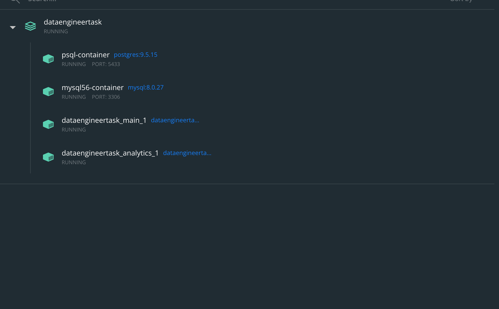

## Running the docker

To get started run ``` docker-compose up ``` in root directory.
It will create the PostgresSQL database and start generating the data.
It will create an empty MySQL database.
It will launch the analytics.py script. 

<!-- Your task will be to write the ETL script inside the analytics/analytics.py file. -->

# Screenshots of the code can be seen below




